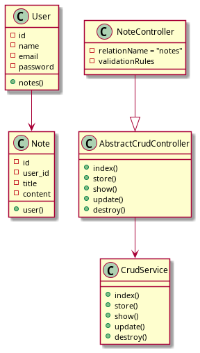
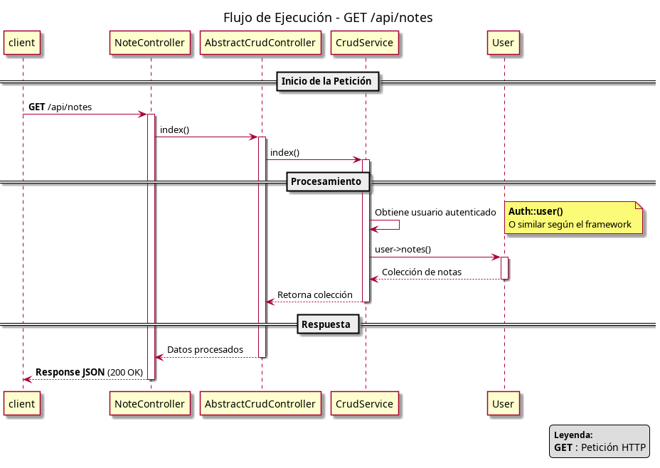
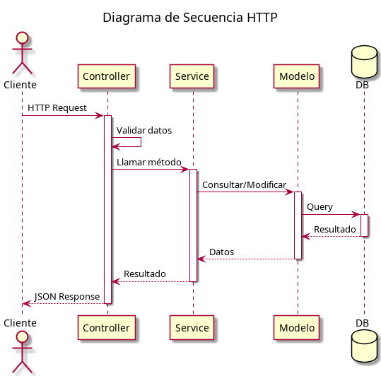

#### [English](./README.en.md) | Español

# User-Scoped Generic CRUD API

- [User-Scoped Generic CRUD API](#user-scoped-generic-crud-api)
  - [Introducción](#introducción)
  - [Tecnologías Utilizadas](#tecnologías-utilizadas)
  - [Instalación e Inicialización](#instalación-e-inicialización)
    - [1. Clonar repositorio](#1-clonar-repositorio)
    - [2. Instalar dependencias](#2-instalar-dependencias)
    - [3. Configurar entorno](#3-configurar-entorno)
      - [Copiar archivo de entorno:](#copiar-archivo-de-entorno)
      - [Generar key:](#generar-key)
    - [4. Ejecutar migraciones](#4-ejecutar-migraciones)
    - [5. Ejecutar seeders (opcional)](#5-ejecutar-seeders-opcional)
    - [6. Levantar servidor](#6-levantar-servidor)
  - [Objetivo del Proyecto](#objetivo-del-proyecto)
  - [Necesidad del Proyecto](#necesidad-del-proyecto)
  - [Arquitectura General](#arquitectura-general)
  - [Componentes Clave](#componentes-clave)
    - [1. AbstractCrudController](#1-abstractcrudcontroller)
    - [2. CrudService](#2-crudservice)
  - [Diagrama de Clases](#diagrama-de-clases)
  - [AbstractCrudController](#abstractcrudcontroller)
    - [Objetivo](#objetivo)
    - [Propiedades clave](#propiedades-clave)
      - [Cada controlador hijo define:](#cada-controlador-hijo-define)
    - [Ejemplo](#ejemplo)
  - [CrudService](#crudservice)
    - [Objetivo](#objetivo-1)
    - [Características:](#características)
  - [Proceso de solicitud de cliente](#proceso-de-solicitud-de-cliente)
  - [Modelo de Seguridad](#modelo-de-seguridad)
    - [Relaciones Eloquent](#relaciones-eloquent)
  - [Sobreescritura de Métodos  (Casos Especiales)](#sobreescritura-de-métodos--casos-especiales)
    - [Ejemplo: Registro por Lotes](#ejemplo-registro-por-lotes)
      - [¿Qué ocurre aquí?](#qué-ocurre-aquí)
  - [Ventajas de esta Arquitectura](#ventajas-de-esta-arquitectura)
  - [Cómo Extender el Sistema](#cómo-extender-el-sistema)
    - [No se necesita escribir lógica CRUD adicional.](#no-se-necesita-escribir-lógica-crud-adicional)
  - [Testing](#testing)
    - [Obtener Token](#obtener-token)
    - [Crear registro](#crear-registro)
    - [Listar registros](#listar-registros)
    - [Mostrar registro específico](#mostrar-registro-específico)
    - [Actualizar registro](#actualizar-registro)
    - [Eliminar registro](#eliminar-registro)
  - [Conclusión](#conclusión)
  - [Autor](#autor)

## Introducción

Esta documentación tiene como objetivo explicar la arquitectura, decisiones técnicas y funcionamiento interno del proyecto.
Está pensada para desarrolladores que ya poseen conocimientos básicos de Laravel, incluyendo:

* Controladores
* Modelos Eloquent
* Rutas
* Migraciones
* Servicios
* Inyección de dependencias

No se explicarán conceptos básicos del framework, sino la implementación específica de esta arquitectura reutilizable basada en un CRUD genérico.

---

## Tecnologías Utilizadas

| Tecnología | Propósito |
| --- | --- |
| Laravel | Framework base |
| Sanctum | Autenticación API basada en tokens |
| Composer | Gestión de dependencias |
| SQLite | Base de datos relacional |
| PHP 8.4+ | Lenguaje principal |
| PHPUnit | Testing |
| Eloquent ORM | Abstracción de base de datos |
| Postman / Curl | Testing manual de endpoints |

---

## Instalación e Inicialización

### 1. Clonar repositorio

```bash
git clone https://github.com/Bamboo-Codec/example-Crud-Abstraction.git
cd api-crud-base
```

### 2. Instalar dependencias

```bash
composer install
```

### 3. Configurar entorno

#### Copiar archivo de entorno:

```bash
cp .env.example .env
```

#### Generar key:

```bash
php artisan key:generate
```

### 4. Ejecutar migraciones
```bash
php artisan migrate
```

### 5. Ejecutar seeders (opcional)

```bash
php artisan db:seed
```
O específico:
```bash
php artisan db:seed --class=DemoSeeder
```

### 6. Levantar servidor

```bash
php artisan serve
```

---

## Objetivo del Proyecto

El proyecto implementa una API REST CRUD orientada a gestionar datos asociados a un único usuario autenticado.

El enfoque principal es:

> Separación clara de responsabilidades \
> Reutilización de lógica CRUD \
> Extensibilidad mediante sobreescritura controlada \
> Arquitectura limpia basada en servicios

La arquitectura permite reutilizar la lógica CRUD mediante una abstracción basada en:

- `AbstractCrudController`
- `CrudService`

El objetivo es evitar duplicación de código siguiendo el principio [DRY](https://www.geeksforgeeks.org/software-engineering/dont-repeat-yourselfdry-in-software-development/?_x_tr_sl=en&_x_tr_tl=es&_x_tr_hl=es&_x_tr_pto=tc) y centralizar la lógica común de acceso a recursos relacionados con un usuario

---

## Necesidad del Proyecto

En muchas aplicaciones, los recursos pertenecen exclusivamente al usuario autenticado.

Ejemplos:

- Notas personales
- Registros de diario
- Tareas
- Eventos privados
- Configuraciones individuales

En estos casos:

- Un usuario **solo puede acceder a sus propios datos**
- No existe un acceso global a todos los registros
- No se requiere lógica multiusuario compleja

Este proyecto resuelve esa necesidad mediante una arquitectura reutilizable.

---

## Arquitectura General

La arquitectura se basa en tres capas principales:

- **Controlador**
- **Servicio** 
- **Modelo**

La API se basa en:

- **Relaciones Eloquent**
- **Controladores abstractos**

La relación típica es:

_Un_ **Usuario** tiene _muchos_ **Recursos**.

Ejemplo implementado en este proyecto:
_Un_ **Usuario** tiene _muchas_ **notas**.

---

## Componentes Clave

### 1. [AbstractCrudController](./app/Http/Controllers/AbstractCrudController.php)

    Clase abstracta que implementa el comportamiento CRUD genérico:
    - index()
    - show()
    - store()
    - update()
    - destroy()
    Su responsabilidad es:
    - Recibir la request
    - Validar datos (si corresponde)
    - Delegar la lógica al servicio correspondiente
    - Retornar respuesta JSON estandarizada

### 2. [CrudService](./app/Services/Crud/CrudService.php)

    Contiene la lógica genérica reutilizable del CRUD.
    Responsabilidades:
    - Acceso a modelo
    - Operaciones estándar
    - Separación de lógica del controlador

---

## Diagrama de Clases





---

## AbstractCrudController

### Objetivo

Centralizar la lógica CRUD común para cualquier recurso relacionado con el usuario autenticado.

### Propiedades clave
> protected string $relationName; \
> protected array $validationRules;


#### Cada controlador hijo define:
- El nombre de la relación en el modelo User
- Las reglas de validación específicas

### Ejemplo

```php
class NoteController extends AbstractCrudController
{
    protected string $relationName = 'notes';

    protected array $validationRules = [
        'title' => 'required|string|max:255',
        'content' => 'required|string',
    ];
}
```


No es necesario escribir métodos CRUD manualmente.

---

## CrudService

### Objetivo

Contener la lógica genérica que interactúa con el modelo y la relación del usuario.

Ejemplo simplificado de la función index:

```php
public function index(Request $request, string $relationName): array
{
    $user = $request->user();

    return [
        $relationName => $user->$relationName()->get()
    ];
}
```

### Características:

> - Siempre trabaja sobre el usuario autenticado
> - Nunca expone datos globales
> - Usa el nombre de relación dinámicamente
> - Es reutilizable para múltiples recursos

<br>

---

## Proceso de solicitud de cliente



---

## Modelo de Seguridad

La seguridad de este proyecto esta basada en `auth:sanctum` solo para simular el caso de un sistema real.

### Relaciones Eloquent

Acceso exclusivo a `$request->user()`

Nunca se consulta directamente el modelo global. Ejemplo: `Note::all()`, en cambio, siempre se usa la siguiente relación: <br> `$request->user()->notes()->get()`


**Esto garantiza aislamiento total entre usuarios.**

---

## Sobreescritura de Métodos <br> (Casos Especiales)

Aunque la arquitectura es genérica, puede ser necesario personalizar comportamiento en ciertos casos.

### Ejemplo: Registro por Lotes

Supongamos que queremos permitir crear múltiples notas en una sola petición.

Podemos sobreescribir `store()` en NoteController para que reciba una lista de notas , por ejemplo:

```php
public function store(Request $request): JsonResponse
{
    $validated = $request->validate([
        'notes' => 'required|array',
        'notes.*.title' => 'required|string|max:255',
        'notes.*.content' => 'required|string',
    ]);

    $user = $request->user();

    foreach ($validated['notes'] as $noteData) {
        $user->notes()->create($noteData);
    }

    return response()->json([
        'notes' => $user->notes()->latest()->take(count($validated['notes']))->get()
    ], 201);
}
```
#### ¿Qué ocurre aquí?

>  Se mantiene la filosofía user-scoped \
>  Se reutiliza la relación \
>  Se extiende comportamiento sin romper la arquitectura base

---

## Ventajas de esta Arquitectura

1. DRY (Don't Repeat Yourself): Elimina código duplicado
2. Mantenible: Cambios en la lógica CRUD se hacen en un solo lugar
3. Flexible: Puedes personalizar reglas de validación por controlador
4. Consistente: Todos los controladores funcionan de la misma manera
5. Testeable: Fácil de probar el servicio independientemente

Esta estructura te permitirá crear nuevos controladores CRUD en segundos, solo definiendo el nombre de la relación y las reglas de validación si son diferentes.

---

## Cómo Extender el Sistema

Para agregar un nuevo recurso:

1. Crear modelo con relación belongsTo(User)

2. Agregar relación hasMany en User

3. Crear controlador extendiendo AbstractCrudController

4. Definir $relationName (el nombre de la relacion agregada en el paso 2)

5. Definir $validationRules (las reglas de validación que recibirá la función store)

6. Registrar ruta apiResource

### No se necesita escribir lógica CRUD adicional.

---

## Testing
### Obtener Token

```bash
curl -X POST http://localhost:8000/api/login \
     -H "Content-Type: application/json" \
     -H "Accept: application/json" \
     -d '{"email":"admin@example.com","password":"password"}'
```

Respuesta:

```bash
{
  "token": "1|xxxxxxxxxxxxxxxx"
}
```

### Crear registro

```bash
curl -X POST http://localhost:8000/api/notes \
     -H "Authorization: Bearer 1|xxxxxxxxxxxx" \
     -H "Content-Type: application/json" \
     -H "Accept: application/json" \
     -d '{
           "title": "Nota de prueba",
           "content": "Este contenido es de prueba"
         }'
```

### Listar registros

```bash
curl -X GET http://localhost:8000/api/notes \
     -H "Authorization: Bearer 1|xxxxxxxxxxxx" \
     -H "Accept: application/json" \
```

### Mostrar registro específico

```bash
curl -X GET http://localhost:8000/api/notes/6 \
     -H "Authorization: Bearer 1|xxxxxxxxxxxx" \
     -H "Accept: application/json" \
```

### Actualizar registro

```bash
curl -X PUT http://localhost:8000/api/users/6 \
     -H "Authorization: Bearer 1|xxxxxxxxxxxx" \
     -H "Content-Type: application/json" \
     -H "Accept: application/json" \
     -d '{
            "title": "Nota actualizada",
            "content": "Este contenido está actualizado",
        }'
```

### Eliminar registro

```bash
curl -X DELETE http://localhost:8000/api/users/6 \
     -H "Authorization: Bearer 1|xxxxxxxxxxxx"
     -H "Accept: application/json" \
```


## Conclusión

Este proyecto demuestra una implementación limpia de un CRUD genérico orientado a recursos por usuario.

Es especialmente útil en sistemas donde:
- Cada usuario gestiona sus propios datos

- No existe necesidad de administración global compleja

- Se desea una arquitectura mantenible y extensible

La combinación de: `AbstractCrudController`,`CrudService`,`Relaciones Eloquent`,`Autenticación basada en usuario`

Permite construir APIs consistentes, seguras y escalables.

---

## Autor

Si tienes feedback sobre esta arquitectura o te interesa conectar profesionalmente, encuéntrame en **[LinkedIn](www.linkedin.com/in/gabriel-da-silva-dev?follow_check=true)**.
